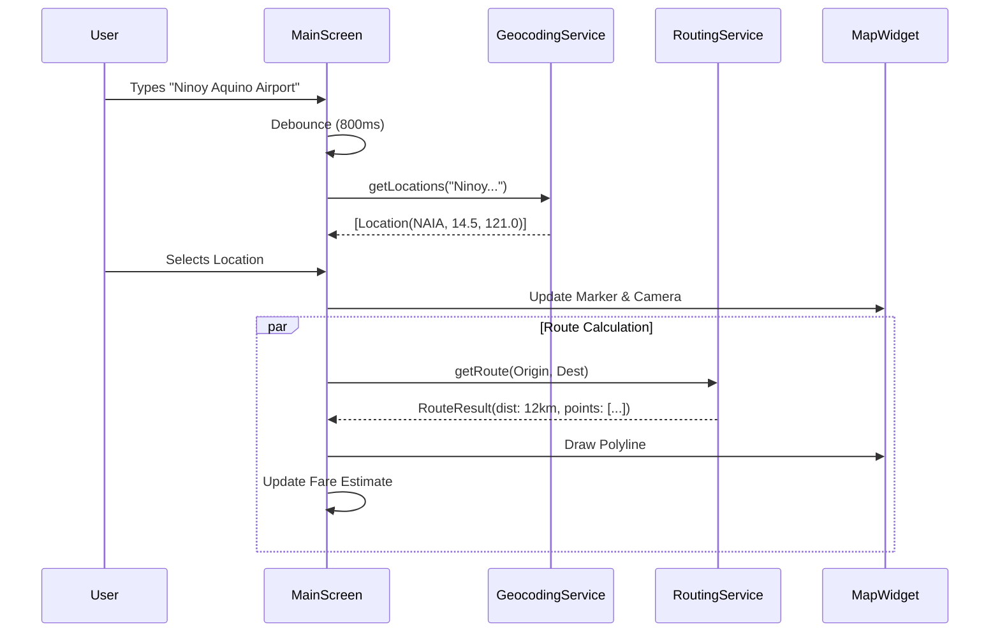

# Implementation Plan: Reactive Map & Autocomplete Fixes

## Executive Summary
This plan addresses the need for a reactive map visualization and reliable autocomplete suggestions using strictly open-source, key-less solutions. The current application has disconnected components: a working but unthrottled geocoding service, a detached map widget, and a routing service that only returns distance. The proposed solution integrates `flutter_map` for visualization, optimizes `Nominatim` usage with debouncing, and upgrades the `OsrmRoutingService` to provide route geometry for visual plotting.

## 1. Current State Analysis

### Geocoding (`lib/src/services/geocoding/`)
*   **Implementation**: `OpenStreetMapGeocodingService` uses the Nominatim API.
*   **Issues**:
    *   **No Debounce**: The UI triggers an API call on every keystroke. This likely triggers rate limiting (Nominatim requires 1 req/sec max) and causes "issues with suggestions".
    *   **Hardcoded Constraints**: Limited to Philippines (`countrycodes=ph`), which is correct for this app.

### Routing (`lib/src/services/routing/`)
*   **Implementation**: `OsrmRoutingService` fetches data from OSRM public API.
*   **Issues**:
    *   **Data Loss**: It currently extracts only the `distance` and discards the route geometry (polyline).
    *   **Visualization**: No mechanism exists to pass route points to the UI.

### UI (`lib/src/presentation/`)
*   **Main Screen**: Uses `Autocomplete` widgets but they are not connected to any map.
*   **Map Widget**: A `MapSelectionWidget` exists but is isolated and not used in the `MainScreen`. It allows point selection but lacks route visualization layers.

### Dependencies
*   `flutter_map`: Already in `pubspec.yaml` (v6+).
*   `latlong2`: Already in `pubspec.yaml`.
*   `http`: Already in `pubspec.yaml`.

## 2. Proposed Open-Source Solution

| Component | Technology | Rationale |
| :--- | :--- | :--- |
| **Geocoding** | **OSM Nominatim** | Free, open-source, no API key required. |
| **Mapping** | **flutter_map** | Native Flutter implementation, performant, supports OSM tiles. |
| **Routing** | **OSRM Public API** | Free, standard protocol, returns both distance and geometry. |

## 3. Implementation Steps

### Step 1: Optimize Geocoding Service & UI
**Goal**: Prevent API rate-limiting and improve user experience.

1.  **Refactor `MainScreen`**:
    *   Implement a **Debounce** mechanism (500ms-1000ms delay) before calling `_geocodingService.getLocations()`.
    *   Handle `LocationNotFoundFailure` gracefully in the UI.

### Step 2: Upgrade Routing Service
**Goal**: Fetch route geometry for visualization.

1.  **Create `RouteResult` Model**:
    *   Fields: `double distance`, `List<LatLng> geometry`, `double duration` (optional).
2.  **Update `RoutingService` Interface**:
    *   Change return type from `Future<double>` to `Future<RouteResult>`.
3.  **Update `OsrmRoutingService`**:
    *   Parse the `geometry` field from the OSRM response.
    *   Note: OSRM returns encoded polylines by default (`overview=simplified` or `full`). We need to decode this or request `geometries=geojson`.
    *   *Decision*: Request `geometries=geojson` for easier parsing with standard libraries, or use a polyline decoder if sticking to the default.

### Step 3: Integrate Reactive Map
**Goal**: Unify Text Input and Map Interaction.

1.  **Enhance `MapSelectionWidget`**:
    *   Add `PolylineLayer` to display the route.
    *   Add `MapController` support to programmatically move the camera when a user selects a location from the text autocomplete.
    *   Accept `List<LatLng> routePoints` as a parameter.
2.  **Integrate into `MainScreen`**:
    *   Insert `MapSelectionWidget` between the input fields and the "Calculate" button (or at the top).
    *   **State Logic**:
        *   **Input -> Map**: When user selects from Autocomplete -> Update Map Markers -> Pan Map to location -> Trigger Route Calculation.
        *   **Map -> Input**: When user taps Map -> Reverse Geocode (Optional/Future) OR just set the coordinate -> Trigger Route Calculation.

### Step 4: Connect Fare Calculation
**Goal**: Ensure fare logic uses the precise routed distance.

1.  **Update `HybridEngine`**:
    *   Refactor `calculateDynamicFare` to use the new `RouteResult` object.
    *   Ensure the `distance` from `RouteResult` is passed to the existing fare formulas.

## 4. Technical Design Details

### Data Flow

### File Changes

1.  **`lib/src/models/route_result.dart`** (New)
    *   Container for distance and polyline points.

2.  **`lib/src/services/routing/`**
    *   `routing_service.dart`: Update interface signature.
    *   `osrm_routing_service.dart`: Parse geometry.
    *   `haversine_routing_service.dart`: Return empty geometry list (fallback).

3.  **`lib/src/presentation/screens/main_screen.dart`**
    *   Add `Timer` for debounce.
    *   Embed `MapSelectionWidget`.
    *   Manage state for `List<LatLng> _routePoints`.

4.  **`lib/src/presentation/widgets/map_selection_widget.dart`**
    *   Add `PolylineLayer`.
    *   Expose `MapController`.

## 5. Risk Management
*   **API Limits**: OSRM Demo server is not for production heavy loads.
    *   *Mitigation*: Add robust error handling. If OSRM fails, fall back to Haversine (straight line) and show a warning that "Route is approximate".
*   **Map Rendering**: Drawing complex polylines can be heavy.
    *   *Mitigation*: OSRM simplifies routes by default.