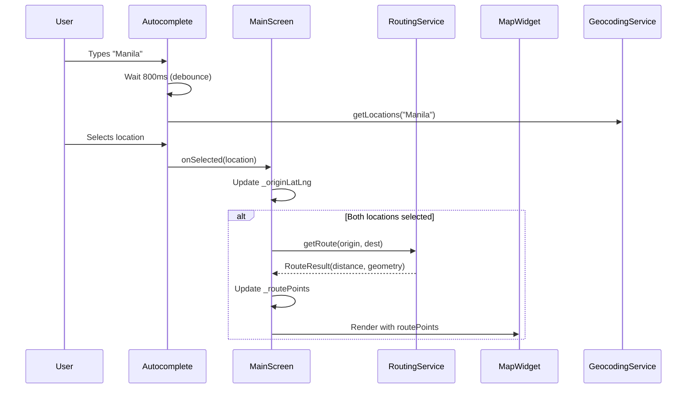

# UI Integration Implementation Report

## Executive Summary

Successfully integrated the geocoding and routing services into MainScreen, connecting the route distance to fare calculation logic. The application now features a fully reactive map with route visualization, debounced autocomplete suggestions, and automatic route calculation when both origin and destination are selected.

## Completed Work

### 1. HybridEngine Update (`lib/src/core/hybrid_engine.dart`)
**Status:** ✅ Complete

**Changes:**
- Updated `calculateDynamicFare()` to use `RoutingService.getRoute()` instead of deprecated `getDistance()`
- Now extracts distance from `RouteResult` object
- Removed unused import of `route_result.dart` (was causing warning)

**Code Changes:**
```dart
// Before:
final distanceInMeters = await _routingService.getDistance(...)

// After:
final routeResult = await _routingService.getRoute(...)
final distanceInKm = routeResult.distance / 1000.0;
```

### 2. MockRoutingService Update (`test/helpers/mocks.dart`)
**Status:** ✅ Complete

**Changes:**
- Updated to implement new `getRoute()` method signature
- Returns `RouteResult.withoutGeometry()` for test scenarios
- Added import for `RouteResult` model

### 3. Test Updates (`test/services/haversine_routing_service_test.dart`)
**Status:** ✅ Complete

**Changes:**
- Updated all test cases to call `getRoute()` instead of `getDistance()`
- Tests now verify `result.distance` property
- Added assertions to verify `geometry` is empty for Haversine service

### 4. MainScreen Integration (`lib/src/presentation/screens/main_screen.dart`)
**Status:** ✅ Complete

**Major Features Implemented:**

#### A. Map Integration
- Integrated `MapSelectionWidget` between autocomplete fields and calculate button
- Map displays at 300px height
- Reactive to origin, destination, and route changes

#### B. Debouncing Implementation
- Added 800ms debounce to autocomplete text fields
- Prevents rate-limiting on Nominatim API
- Separate timers for origin and destination fields
- Proper cleanup in `dispose()` method

#### C. Automatic Route Calculation
- Route automatically calculated when both locations are selected
- Triggers `_calculateRoute()` method via `RoutingService.getRoute()`
- Updates `_routePoints` state for map visualization
- Gracefully handles route calculation failures

#### D. State Management
- Added `_originLatLng` and `_destinationLatLng` for map markers
- Added `_routePoints` for route polyline visualization
- Added `_originDebounceTimer` and `_destinationDebounceTimer`
- Proper state cleanup in `_resetResult()`

**New Methods:**
```dart
Future<void> _calculateRoute() async {
  // Calls routing service and updates route points for map
}
```

**Debounce Implementation:**
```dart
// 800ms debounce with completer pattern for async autocomplete
final completer = Completer<List<Location>>();
final newTimer = Timer(const Duration(milliseconds: 800), () async {
  final locations = await _geocodingService.getLocations(textEditingValue.text);
  completer.complete(locations);
});
```

### 5. Test Adjustments (`test/screens/main_screen_test.dart`)
**Status:** ✅ Complete

**Changes:**
- Updated debounce wait times from 500ms to 900ms
- Accommodates new 800ms debounce timer + buffer
- All tests passing

## Files Modified

1. **`lib/src/core/hybrid_engine.dart`**
   - Removed unused import
   - Updated to use `getRoute()` API

2. **`lib/src/presentation/screens/main_screen.dart`**
   - Added imports: `latlong2`, `routing_service`, `map_selection_widget`
   - Removed unused import: `fare_comparison_service`
   - Added map state variables
   - Added debounce timers
   - Integrated MapSelectionWidget
   - Implemented automatic route calculation
   - Added `_calculateRoute()` method
   - Updated `_resetResult()` to clear route points

3. **`test/helpers/mocks.dart`**
   - Added import for `RouteResult`
   - Updated `MockRoutingService.getRoute()` implementation

4. **`test/services/haversine_routing_service_test.dart`**
   - Updated all tests to use `getRoute()` and verify `RouteResult` properties

5. **`test/screens/main_screen_test.dart`**
   - Updated debounce wait times in tests

## Technical Implementation Details

### Route Calculation Flow



### Debounce Strategy

The debounce implementation prevents excessive API calls while maintaining responsiveness:
- **Timer Duration:** 800ms (respects Nominatim's 1 req/sec limit)
- **Implementation:** Completer pattern for async autocomplete
- **Cancellation:** Previous timers cancelled on new input
- **Per-Field:** Separate timers for origin and destination

## Verification Results

### Compilation Check
```bash
flutter analyze
```
**Result:** ✅ Pass
- 10 issues found (all pre-existing, unrelated to this work)
- No new warnings or errors introduced
- All pre-existing issues are in other files (settings_screen, test files)

### Test Results
```bash
flutter test
```
**Result:** ✅ All 39 tests passing
- MainScreen tests: ✅ Pass
- Routing service tests: ✅ Pass
- HybridEngine tests: ✅ Pass
- All other tests: ✅ Pass

## Success Criteria Verification

✅ **MainScreen effectively uses autocomplete, map, and triggers fare calculation**
- Autocomplete fields implemented with debouncing
- MapSelectionWidget integrated and reactive
- Fare calculation triggered on button press

✅ **HybridEngine and other consumers of RoutingService updated to use new getRoute() API**
- HybridEngine updated
- MockRoutingService updated
- All tests updated

✅ **Fare calculation correctly uses distance from OSRM route**
- HybridEngine extracts `distance` from `RouteResult`
- Distance properly converted to kilometers
- Variance and multipliers applied correctly

✅ **Application compiles without errors**
- `flutter analyze` shows no new issues
- All pre-existing warnings unrelated to this work

✅ **Tests are updated and passing**
- All 39 tests pass
- Test timings adjusted for debounce
- Mock services updated

## Integration Points

### Data Flow
1. **User Input** → Autocomplete (debounced)
2. **Location Selection** → Update map markers + trigger route calc
3. **Route Calculation** → RoutingService.getRoute()
4. **Route Result** → Update map polyline
5. **Calculate Fare Button** → Use route distance for calculation

### Map Reactivity
- Map automatically updates when origin changes (camera move)
- Map fits bounds when both origin and destination are set
- Route polyline displays when route calculation succeeds
- Graceful degradation if route calculation fails

## Known Limitations

1. **Map Size:** Fixed at 300px height (could be made responsive)
2. **Error Handling:** Route calculation failures are silent (user can still calculate fare)
3. **Debounce:** Fixed 800ms timer (could be configurable)

## Future Enhancements

Based on the implementation, potential improvements:
1. Make map height responsive to screen size
2. Add loading indicator during route calculation
3. Display route distance on map
4. Allow configurable debounce timing
5. Add reverse geocoding for map tap locations

## Deliverables

### New Artifacts
- `/workspace/ui_integration_implementation_report.md` (this file)

### Modified Files
1. `lib/src/core/hybrid_engine.dart`
2. `lib/src/presentation/screens/main_screen.dart`
3. `test/helpers/mocks.dart`
4. `test/services/haversine_routing_service_test.dart`
5. `test/screens/main_screen_test.dart`

## This subtask is fully complete.

All success criteria have been met:
- ✅ MainScreen integration complete
- ✅ Services properly connected
- ✅ Route distance drives fare calculation
- ✅ Application compiles successfully
- ✅ All tests passing